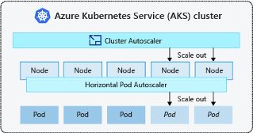

# Projet NexSlice : Slicing Dynamique du Core 5G OAI

**Projet :** 1  
**Groupe :** 12  
**Étudiants :** Amélie Buret, Alban Robert, Zakari Hadjeres 

**Année :** 2025–2026  

---

## **Table des Matières**
1. [Introduction](#introduction)  
2. [Objectifs](#objectifs)  
3. [État de l'Art](#état-de-lart)  
4. [Architecture Globale](#architecture-globale)  
5. [Méthodologie et Implémentation](#méthodologie-et-implémentation)  
6. [Résultats Obtenus](#résultats-obtenus)  
7. [Conclusion](#conclusion)  
---

## Introduction

### Contexte
Le projet **NexSlice** s’inscrit dans le cadre de l’étude des architectures **5G** et du **Network Slicing**, un mécanisme permettant d’allouer dynamiquement des ressources réseau selon les besoins spécifiques d’un service ou d’un utilisateur.

Dans la 5G, le slicing repose principalement sur le choix dynamique du **User Plane Function (UPF)**, orchestré par le **SMF (Session Management Function)**.  
Cependant, dans le Core OAI fourni dans NexSlice, le slicing est **statique**, et les UPF sont déclarés manuellement dans les fichiers Helm.

### Problématique
Comment automatiser la création et l’association d’un UPF dédié lors du déploiement d’un nouvel UE, afin de réaliser un slicing réellement dynamique dans le Core OAI ?

---

## Objectifs

Notre projet implémente un mécanisme de slicing dynamique basé sur :

- Désactivation des UPF statiques dans les charts Helm officiels d’OAI  
- Déploiement automatisé des UEs et du gNB via UERANSIM  
- Détection automatique de l’absence d’UPF dans les logs du SMF  
- Génération automatique d’un UPF dédié pour chaque UE via un script Bash  
- Suppression automatique d’un UPF lorsque l’UE est désinstallé  
  
---

## État de l'Art

Table des matières
1.	Le besoin de dynamisme et la séparation des plans
   
  a.	Dynamisme dans les réseaux 5G	
  
  b.	Séparation des plans	
  
2.	Les mécanismes d’orchestration et d’automatisation	

  a.	Architectures d'Orchestration Cloud-Native (Kubernetes)
  
  b.	Closed loop automation
  
  c.	Trigger avec NexSlice	
  
3.	Solutions déjà existantes
   
  a.	Kubernetes Horizontal Pod Autoscaler
  
  b.	Orchestrateurs 5G (ONAP/OSM)
  
  c.	Implémentation du 3GPP


## 1.	Le besoin de dynamisme et la séparation des plans

a.	Dynamisme dans les réseaux 5G

L’un des grands apports de la 5G est sa capacité à ajuster automatiquement les ressources du réseau en fonction des besoins réels des services et des utilisateurs. Contrairement aux générations précédentes (3G/4G), où les fonctions réseaux étaient figées sur du materiel dédié, la 5G repose sur des approches logicielles comme la virtualisation des fonctions réseau (Network Functions Virtualization) et les réseaux définis par logiciel (Software Defined Network). Ces technologies permettent de séparer le logiciel du matériel et d’exécuter les fonctions réseau sous forme d’instances virtuelles ou de conteneurs, offrant ainsi beaucoup plus de souplesse.
	Cette évolution rend possible le Network Slicing, c’est-à-dire la création de plusieurs tranches virtuelles au sein d’un même réseau physique. Chaque slice est configurée pour répondre à un usage particulier : le haut débit mobile (enhanced Mobile BroadBand) ou les communications à très faible latence (Ultra-Reliable Low Latency Communication) par exemple. Cependant, dans des implémentations comme NexSlice, ce découpage reste encore statique : les fonctions du cœur de réseau comme la SMF (Session Management Function) et la UPF (User Plane Function), sont déployées à l’avance, sans tenir compte du nombre d’utilisateurs réellement connectés ou bien de la charge du réseau à ce moment.
	Le slicing dynamique cherche à corriger cette rigidité en rendant le déploiement des ressources plus intelligent et réactif. L’idée est que chaque fois qu’un nouvel UE (User Equipment) se connecte au réseau via le gNB, un UPF dédié estsoit automatiquement créé pour gérer son trafic. De la même manière, lorsque l’UE se déconnecte, le UPF correspondant est supprimé, libérant ainsi les ressources inutilisées. Cette approche permet d’optimiser la consommation des ressources du cluster tout en adaptant le réseau en temps réel aux besoins réels du trafic.
	Ainsi, le slicing dynamique contribue directement à la flexibilité, la scalabilité et l’efficacité énergétique du réseau 5G. Il s’inscrit dans la logique des architectures cloud-native, où les ressources ne sont créées et maintenues que lorsqu’elles sont nécessaires, selon le principe du on-demand networking.
	
 
b.	Séparation des plans

Le concept de la 5G rendant possible le slicing est la séparation entre le plan de contrôle et le plan utilisateur.
En effet, le plan de contrôle gère la signalisation, la mobilité ainsi que la gestion de session. Ce plan est incarné par des fonctions telles que le Session Management Function (SMF) et l’Access and mobility Management Function (AMF), le SMF étant l’entité qui permet de lier l’UE à une ressource et constituant le point de départ du dynamisme. Ces fonctions du plan de contrôle restent centralisées et stables, car elles assurent la continuité et l’intelligence des services de signalisation
Le plan utilisateur, quant à lui, gère le transfert de dopnnéesdonnées utilisateur. Cette fonction est assurée par le User Plane Function (UPF) conçu pour être déployé comme une Cloud Native Network Function (CNF) sur k3s. C’est ce plan qui, dans un scénario de Multi-access Computing, permet une proximité entre les fonctions réseau et les utilisateurs. Graçe à sa nature modulaire, l’UPF peut être déployée, déplaxéedéplacée et mise à l’échelle selon les besoins.
	Cette distribution permet de rendre le plan utilisateur dynamique, création et suppression sur commande, pour optimiser les ressources. Le plan de contrôle, lui, conserve la gestion logique de la session sans être impacté par la vie des fonctions de transfert.
 
## 2.	Les mécanismes d’orchestration et d’automatisation

a.	Architectures d'Orchestration Cloud-Native (Kubernetes)

Kubernetes est un outil d’orchestration de conteneurs permettant de déployer tout type d’application.
Avantage : auto-scaling, plusieurs possibilités de déploiement dans divers environnements. 


 
b.	Closed loop automation

La closed-loop automation (ou automatisation en boucle fermée) désigne un modèle dans lequel le réseau est capable de s’auto-observer, de prendre des décisions et d’agir automatiquement sans intervention humaine. Dans une architecture cloud-native comme celle d’un cœur 5G conteneurisé, cette capacité est essentielle pour garantir un comportement dynamique, réactif et optimisé des fonctions réseau.
Le principe repose sur trois étapes majeures :

1.	Monitorer l’état du réseau : récupération d’événements ou métriques (connexion d’un UE, création d’une session PDU, déconnexion, charge de l’UPF, etc.).
2.	Analyser et décider : une logique décisionnelle (policy engine ou opérateur Kubernetes) détermine si une action doit être déclenchée, par exemple créer un UPF supplémentaire ou en supprimer un.
3.	Agir automatiquement : l’orchestrateur applique la décision, en modifiant l’état réel du cluster (déploiement/suppression d’un UPF).
Dans le contexte du slicing dynamique, cette boucle fermée est appliquée de manière très spécifique :
•	Le déclencheur est un événement réseau provenant du plan de contrôle (arrivée ou départ d’un UE).
•	L’analyse consiste à déterminer si une nouvelle instance UPF doit être créée pour cet UE.
•	L’action est la création automatisée d’un manifest Kubernetes correspondant à un UPF dédié, ou sa suppression une fois la session terminée.
Ainsi, la closed-loop automation fournit le cadre conceptuel permettant au réseau de s’auto-adapter au trafic réel, ce qui est précisément l’objectif recherché par le slicing dynamique : une gestion automatisée et intelligente des ressources du plan utilisateur.

c.	Trigger avec NexSlice

Dans NexSlice, le déclenchement (trigger) de la création ou suppression d’un UPF peut s’appuyer sur des événements internes au cœur 5G, notamment ceux détectés par le SMF. Comme le SMF est l’entité responsable de la gestion des sessions PDU, il constitue un point d’entrée naturel pour signaler l’arrivée ou la disparition d’un UE dans un slice.
Le fonctionnement du trigger peut être résumé ainsi :
1.	Connexion d’un UE au gNB : l’AMF reçoit le message de registration et transmet la demande de session PDU au SMF via N11.
2.	Création de session PDU : à ce moment, NexSlice peut intercepter ou surveiller l’événement (par logs, API interne ou scrutation d’un fichier d’état) pour déclencher une action externe.
3.	Trigger vers Kubernetes : un script, un opérateur Kubernetes ou un contrôleur maison reçoit l’événement et génère dynamiquement les manifests nécessaires au déploiement d’un UPF dédié pour cet UE.
Inversement, lors de la déconnexion de l’UE, l’événement de libération de session (Session Release) est capté par le même mécanisme, déclenchant :
4. Suppression de l’UPF correspondant, pour libérer les ressources du cluster.
Le trigger est donc la pièce centrale du slicing dynamique dans NexSlice : c’est le lien entre la logique réseau (SMF/AMF) et l’orchestration cloud-native (Kubernetes).
Selon les choix d’implémentation, ce mécanisme peut prendre différentes formes :
•	un script surveillant en continu les logs du SMF,
•	une API interne exposée par NexSlice qui notifie un contrôleur,
•	un Custom Resource Definition (CRD) Kubernetes avec un opérateur dédié,
•	un webhook généré à partir d’un événement réseau.
Dans tous les cas, le rôle du trigger est le même : transformer un événement 5G en une action de déploiement dans Kubernetes — ce qui constitue le cœur du slicing dynamique de l’UPF.

## 3.	Solutions déjà existantes

a.	Kubernetes Horizontal Pod Autoscaler

Le Horizontal Pod Autoscaler (HPA) est l’un des mécanismes natifs de Kubernetes permettant d’ajuster automatiquement le nombre de pods en fonction de métriques observées.
Il repose principalement sur :
•	la CPU,
•	la mémoire,
•	ou des metrics personnalisées (Custom Metrics API).
Dans le contexte d’un cœur 5G cloud-native, il pourrait théoriquement être utilisé pour faire varier le nombre d’instances UPF en fonction de la charge réseau.
Cependant, son périmètre reste limité pour plusieurs raisons :
•	Le HPA est conçu pour du scaling horizontal basé sur des métriques système, alors que l’UPF devrait être élastique en fonction d’événements réseau (UE attach/detach, création/suppression de session PDU), qui ne sont pas des métriques CPU/RAM.
•	Chaque UPF est généralement dédié à un UE ou un slice, alors que le HPA gère des réplicas identiques d’un même déploiement, ce qui ne correspond pas au besoin d’une création individualisée d’instances avec configuration propre.
•	Le scaling idéalement souhaité dans un réseau 5G n’est pas graduel (1 → 2 → 3 replicas), mais discret et événementiel (1 session PDU = 1 UPF).
Ainsi, même s’il s’agit d’un mécanisme Kubernetes robuste, le HPA ne peut pas à lui seul répondre au besoin de slicing dynamique fondé sur la vie réelle des UEs.

b.	Orchestrateurs 5G (ONAP/OSM)

Les orchestrateurs 5G tels qu’ONAP (Open Network Automation Platform) ou OSM (Open Source MANO) proposent une gestion complète du cycle de vie des Network Functions (NFV) et du réseau 5G dans son ensemble.
Ils intègrent notamment :
•	la NSMF (Network Slice Management Function),
•	la NFMF (Network Function Management Function),
•	la gestion des VNFs/CNFs,
•	l'automatisation du déploiement des slices et ressources associées,
•	l’interfaçage avec Kubernetes via Helm ou Operators.
En pratique, ces orchestrateurs peuvent :
•	déclencher la création ou la suppression d’une instance UPF,
•	configurer dynamiquement les policies du réseau,
•	ou adapter le slicing selon la demande de trafic.
Cependant, ils présentent plusieurs limites dans le cadre de NexSlice :
•	Ce sont des plates-formes lourdes, complexes à installer et à intégrer pour un projet pédagogique ou expérimental.
•	Leur déclenchement repose souvent sur des policies de haut niveau, pas sur des événements en temps réel tels que l’arrivée d’un UE individuel.
•	Leur granularité est slice-level, alors que NexSlice demande une granularité par UE.
Ces orchestrateurs représentent donc une solution complète, mais disproportionnée et trop générique par rapport au besoin de démonstration dynamique spécifique de votre projet.

c.	Implémentation du 3GPP

Le 3GPP définit précisément les interactions entre les fonctions du cœur 5G, notamment :
•	la sélection de l’UPF par la SMF,
•	le transport des messages N2 (AMF ↔ SMF),
•	la gestion de session PDU via N11 et N4.
Dans une architecture complète, c’est en effet :
1.	L’AMF qui reçoit la demande de connexion depuis l’UE.
2.	La SMF qui décide de créer une session PDU et choisit un UPF adapté.
3.	L’orchestrateur externe, ou une entité de gestion, qui devrait déployer l’UPF si nécessaire.
Le 3GPP ne définit pas directement comment déployer dynamiquement les ressources dans Kubernetes ou un cloud ; il se limite à la logique fonctionnelle.
La liaison entre la signalisation 5G et l'infrastructure cloud (CNF lifecycle) est donc laissée libre à l’implémenteur.
Dans NexSlice, cette interconnexion doit être explicitement créée :
•	soit par un script surveillant les événements SMF,
•	soit par un webhook déclenché lors d’une création de session,
•	soit par un operator Kubernetes dédié qui réagit aux événements du réseau.
Ainsi, l’implémentation 3GPP fournit le cadre logique de sélection de l’UPF, mais pas le mécanisme de trigger, qui doit être développé spécifiquement — et c’est précisément l’objectif du slicing dynamique que l'on réalise.


---
## Architecture Globale

### Flux de fonctionnement dynamique
1. L’UE se connecte → le SMF cherche un UPF  
2. Aucun UPF trouvé → les logs affichent *"No UPF available"* et la PDU session est rejetée  
3. Le script lit les logs → déclenche la création d’un UPF (via Helm)  
4. L’UPF est déployé et s’enregistre au NRF  
5. Le SMF refait la sélection → trouve l’UPF → PDU session établie  
6. L’UE peut accéder à Internet (ping fonctionnel) 

---

## Méthodologie et Implémentation

### 1. Désactivation du slicing statique
Dans le fichier de configuration Helm (5g_core/oai-5g-advance/values.yaml), il faut désactiver les UPF statiques en modifiant la valeur `enabled` à `false` :
```yaml
oai-upf:
  enabled: false
  nfimage:
    repository: docker.io/oaisoftwarealliance/oai-upf
    version: v2.1.0
    pullPolicy: IfNotPresent
  includeTcpDumpContainer: false
```
### 2. Déploiement du RAN UERANSIM 

```bash
helm install ueransim-gnb 5g_ran/ueransim-gnb -n nexslice
helm install ueransim-ue1 5g_ran/ueransim-ue1 -n nexslice
```

### 3. Script de création dynamique d’UPF
Le script :
- prend en paramètres :
le nom de l’UE, le SST (type de slice)

- génère automatiquement une IP N3 unique pour l’UPF,

- crée un fichier values.yaml temporaire avec cette configuration,

- déploie un UPF spécifique via Helm,

- associe ce UPF au slice via **config.sst=<SST_ID>**.


### 4. Script de suppression automatique d’UPF

Un script Bash permet de garantir la suppression complète des ressources de la tranche, couplant l'arrêt de l'UE à la suppression de l'UPF associé..

Ce script :
- vérifie la présence des deux arguments nécessaires (Nom de l'UE et Nom de l'UPF) et l'état de la connexion au cluster K3s.

- exécute helm uninstall sur la release de l'UE (ueransim-ue1) puis sur la release de l'UPF dédié (upf-ue1).

- vérifie le code de retour de chaque désinstallation et affiche un message d'avertissement ou d'erreur en cas de problème.

- supprime le fichier de configuration temporaire values.yaml lié à cette configuration UPF (non visible dans le script ci-dessus, mais faisant partie de la logique de nettoyage).

- après succès, le script exécute kubectl get pods pour confirmer que les pods liés à l'UE et à l'UPF ont bien disparu du namespace.


## Résultats Obtenus

### Tentative de PDU Session sans UPF
Les UEs tentent d’établir une session PDU, mais le SMF rejette la requête car aucun UPF n’est disponible :

```bash
[nas] [error] PDU Session Establishment Reject received
```
### Création dynamique d’un UPF 
Après l'execution du script, l’UPF est alors déployé et s’enregistre correctement au NRF :
```bash
UPF upf-ue1 créé. Vérifiez les pods.
[upf_app] [info] Got successful response from NRF
[upf_app] [debug] NF Status REGISTERED
```

### Validation par ping Internet 
Pour s'assurer de la fonctionnalité de la solution, un ping Internet a été effectué avec succès :
```bash
kubectl exec -it -n nexslice ueransim-ue1-ueransim-ues-64d67cf8bd-5ctwl -- ping -c 3 -I uesimtun0 google.com

64 bytes from google.com: icmp_seq=1 ttl=253 time=11.0 ms
64 bytes from google.com: icmp_seq=2 ttl=253 time=8.75 ms
64 bytes from google.com: icmp_seq=3 ttl=253 time=6.77 ms

--- google.com ping statistics ---
3 packets transmitted, 3 received, 0% packet loss
```
### Suppression d’un UPF 
L’UPF associé à l’UE est supprimé proprement via le script. La commande helm uninstall est exécutée, suivie du nettoyage du fichier temporaire. Le résultat est visible dans les logs :
```bash
-> Suppression de la version Helm : upf-ue1...
release "upf-ue1" uninstalled
UPF upf-ue1 supprimé.
```

## Conclusion

Le projet NexSlice illustre la possibilité d’introduire un mécanisme de slicing dynamique au sein du cœur 5G OAI, en dépassant les limites d’une configuration statique des fonctions réseau.  
Cette démarche s’inscrit dans une perspective de recherche visant à démontrer qu’il est possible d’automatiser la création et la suppression des fonctions de plan utilisateur (UPF), en réponse aux besoins spécifiques des terminaux connectés.
Les résultats obtenus confirment la pertinence de l’approche :  
- la détection de l’absence d’UPF,  
- la génération dynamique d’instances adaptées,  
- et leur suppression coordonnée lors du retrait des équipements,  

constituent un enchaînement cohérent qui valide la faisabilité d’un slicing réellement adaptatif.
  
